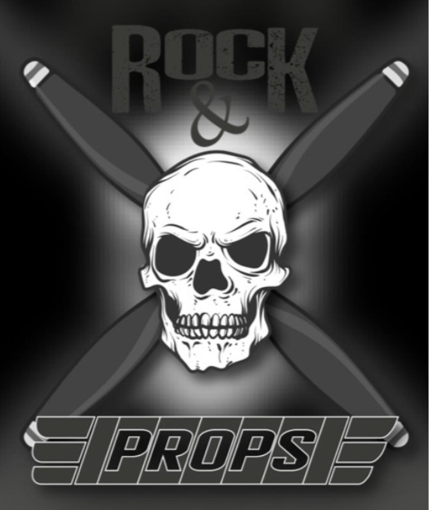

# **-+-ROCK&PROPS-+-**

Este proyecto de e-comerce realizado en React es el proyecto final del curso
de React de Coderhouse.

> > #### Importante
> >
> > Recuerde instalar los repositorios despues de la descarga.

### Componentes:

- Navbar
- Cart Context
- Catalogo
- Detalle de Producto
- Cart
- Formulario de Compra

### Librerias:

- react-bootstrap (https://www.npmjs.com/package/react-bootstrap)
- react-dom (https://www.npmjs.com/package/react-dom)
- firebase (https://www.npmjs.com/package/firebase)
- react-loader-spinner (https://www.npmjs.com/package/react-loader-spinner)
- sass (https://www.npmjs.com/package/sass)

### Navegación:

